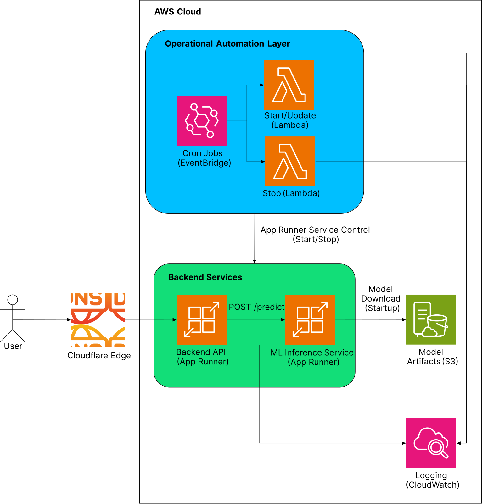
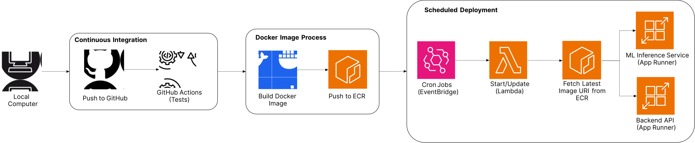
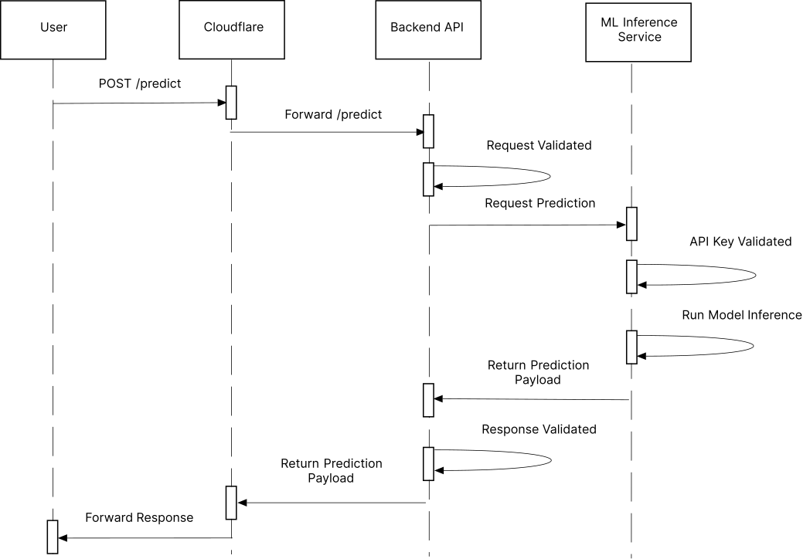

# Political Bias Inference Web App

## Description
An experimental political bias inference web API that predicts the political bias of U.S.-context articles using machine learning.

## Why?
News consumers may be unaware of the political bias of the news sources they consume, which can lead to a skewed perception of current events and contribute to political polarization. This web app aims to provide users with insights into the political bias of articles, helping them make more informed decisions about the news they consume and encouraging critical thinking about media sources.

This project was inspired by platforms such as AllSides and Ground News, which provide bias ratings of media outlets in U.S. contexts. What makes this project unique is that it predicts bias at the **article level** and for **any U.S.-context text**, rather than assigning bias only to news sources. 

Additionally, the system exposes this inference functionality through a web API that developers can integrate into their applications and services.

## Try the Live Demo
### Note: The live demo is only available during weekdays from 9:00 am to 4:00 pm (Eastern Time).
Link to the live demo: [Live Demo](https://api.osvaldohernandez.dev)
### Curl commands to test the API:
GET /health:
```bash
curl -X GET https://api.osvaldohernandez.dev/health
```
POST /api/predict:
```bash
TEXT="President Donald Trump's plane, Air Force One, returned to Joint Base Andrews about an hour after departing for Switzerland on Tuesday evening. White House press secretary Karoline Leavitt said the decision to return was made after takeoff when the crew aboard Air Force One identified a minor electrical issue and, out of an abundance of caution, decided to turn around.\\\\n\\\\nA reporter on board said the lights in the press cabin of the aircraft went out briefly after takeoff, but no explanation was immediately offered."

curl -X POST https://api.osvaldohernandez.dev/api/predict \
-H "Content-Type: application/json" \
-d "$(jq -n --arg text "$TEXT" '{text: $text}')"
```

## High-level architecture
- Using cron jobs scheduled with AWS EventBridge, the two services are automatically started at 9:00 am and stopped at 4:00 pm (Eastern Time) on weekdays using AWS Lambda functions.
- The AWS Lambda Start/Update function starts the AWS App Runner instances and updates the instances with the latest Docker images from AWS ECR. The Lambda Stop function stops the App Runner instances.
- The system is deployed on AWS App Runner as two services: a backend API and an ML inference service. 
- The backend API handles incoming requests, such as POST /api/predict, performs input validation, and forwards valid requests to the ML inference service. 
- The ML inference service loads the machine learning model and label encoder artifacts from AWS S3 at startup, performs inference on the input text, and returns the prediction results back to the backend API, which sends the response to the client. 
- Logs from all AWS services, such as error logs, are collected and stored in AWS CloudWatch for monitoring and debugging purposes.
- Cloudflare is used for DNS management, routing incoming requests and responses between the user and the backend API.

<p align="center">
  
</p>

## Table of contents
1. [Description](#description)
2. [Why?](#why)
3. [Try the live Demo](#try-the-live-demo)
4. [High-level architecture](#high-level-architecture)
5. [Tech stack](#tech-stack)
6. [Deployment flow](#deployment-flow)
7. [Request-Response flow](#request-response-flow)
8. [Endpoints](#endpoints)
9. [System requirements](#system-requirements)
10. [How to run locally](#how-to-run-locally)
11. [Directory structure](#directory-structure)
12. [Design choices and tradeoffs](#design-choices-and-tradeoffs)
13. [Future work and improvements](#future-work-and-improvements)
14. [Notes](#notes)
15. [Sources](#sources)

## Tech stack
- Node.js (Express) with TypeScript
- Python (Flask)
- Docker and Docker Compose
- AWS App Runner
- AWS EventBridge
- AWS Lambda
- AWS S3 
- AWS Elastic Container Registry (ECR)
- AWS CloudWatch
- Cloudflare (DNS management)

## Deployment flow
The deployment flow of the web app is as follows:
1. Local code is version controlled using Git and pushed to GitHub.
2. The code is tested using GitHub Actions to ensure that all tests pass and the code is ready for deployment.
3. Once the code is validated, a production Docker image is built for each of the services (backend API and ML inference) and pushed to AWS Elastic Container Registry (ECR) manually.
4. AWS EventBridge cron jobs then trigger AWS Lambda functions to start the AWS App Runner instances for the services and update the instances with the latest Docker images from ECR.

<p align="center">
  
</p>

## Request-Response flow
The Request-Response flow of the web app for a "happy path" is as follows:
1. The user enacts the POST /api/predict endpoint, sending a request with the JSON text payload. 
2. Cloudflare receives the request and forwards it to the backend API.
3. The backend API handles the request, performing a per-IP rate limit check and input validation on the request data. 
4. If the rate limit hasn't been reached and the input data is valid, the backend API sends a request to the ML inference service. 
5. The ML inference service receives the request, and validates both the API key in the response headers and the request schema.
6. If the API key and request schema are valid, the ML inference service performs inference on the text (using the loaded machine learning model and label encoder artifacts).
7. The ML inference service returns the prediction response to the backend API.
8. The backend API receives the response and validates its schema.
9. If the response schema is valid, the backend API forwards the response to Cloudflare.
10. Finally, Cloudflare receives the response from the backend API and forwards it to the client.

<p align="center">
  
</p>

## Endpoints

<details>
    <summary>GET /</summary>

### GET /
Landing page with API overview and usage instructions.

**Response**:

Response status: 304 

Return the browser-cached version of the landing page if the client has a cached version available, otherwise return the landing page content.

Response status: 200

Response could be either a simple HTML page or a JSON response with HTML code of the newest version of the landing page.

</details>

<details>
    <summary>GET /health</summary>

### GET /health
Health check endpoint. Returns JSON with service status and uptime.

**Response**:

Response status: 200
```json
{
    "status": "ok",
    "service": "server",
    "timestamp": "2026-03-01T04:33:40.199Z",
    "uptime_seconds": 28400
}
```

</details>

<details>
    <summary>GET /predict</summary>

### GET /predict
UI page for users to interact with the API and submit text for bias inference.

**Response**:

Response status: 304 

Return the browser-cached version of the UI-prediction page if the client has a cached version available, otherwise return the UI page content.

Response status: 200

Response could be either a simple HTML page or a JSON response with HTML code of the newest version of the UI page.

</details>

<details>
    <summary>POST /api/predict</summary>

### POST /api/predict
Accepts JSON with a news article text and returns bias inference results.

**Required headers**:
```json
Content-Type: application/json
X-Internal-API-Key: <api_key>
```

**Request body**:
```json
{
    "text": "Full text of a news article (max 3000 chars)"
}
```
**Contraints**:
- Input text should ideally be a news article or a portion of one (max 3000 chars).
- API is designed to handle English news articles of U.S. contexts.
            
**Response**:

Response status: 200
```json
{
    "prediction": "center",
    "model_version": "linear_svc_pipeline_v1",
    "label_encoder_version": "articles-bypublisher_LabelEncoder_v1"
}
```

Response status: 400
```json
{
    "error": "Invalid request data"
}
```

Response status: 401
```json
{
    "error": "Unauthorized access. Invalid API key."
}
```

Response status: 429
```json
{
    "error": "Too many requests, please try again later."
}
```

Response status: 502
```json
{
    "error": "Bad Gateway Error"
}
```

</details>

## System requirements
For running the project locally in development mode, you will need to have the following installed:
- Docker Desktop
- The Node.js requirements are stored in the [package.json](./web_app/server/package.json) file, and the Python requirements are stored in the [requirements.prod.txt](./services/ml_inference/requirements.prod.txt) file

## How to run locally
Ensure Docker Desktop is installed and running on your machine. Then, follow these steps:
1. Clone the repository:
```bash
git clone https://github.com/A1-D0/political_bias_inference_web_app.git  
```
2. Navigate to the project directory:
```bash
cd political_bias_inference_web_app
```
3. Build and run the Docker containers using Docker Compose (~3-4 minutes):
```bash
docker compose -f ./docker-compose.dev.yaml up -d --build
```
4. The API will be available at `http://localhost:3000` (the ML inference service will not be accessible, but will run).
5. The curl commands to test the API endpoints are provided in the [Try the Live Demo](#try-the-live-demo) section above. You can use those same commands to test the API locally, just make sure to change the URL from `https://api.osvaldohernandez.dev` to `http://localhost:3000`. Alternatively, you can use tools like Postman to send requests to the API.

## Directory structure
```bash
.
├── aws_scripts
│   ├── aws_export_role.sh
│   └── lambda
│       ├── lambda_apprunner_start.py
│       ├── lambda_apprunner_stop.py
│       ├── SERVICE_ARNS.json
│       └── SERVICE_CONFIG.json
├── docker-compose.dev.yaml
├── README.md
├── services
│   └── ml_inference
│       ├── dev_requirements.txt
│       ├── Dockerfile
│       ├── Dockerfile.dev
│       ├── entrypoint.dev.sh
│       ├── entrypoint.service.sh
│       ├── pyproject.toml
│       ├── requirements.prod.txt
│       ├── secrets
│       ├── src
│       ├── tests
│       ├── venv
│       └── wheels
└── web_app
    ├── server
    │   ├── Dockerfile
    │   ├── Dockerfile.dev
    │   ├── entrypoint.dev.sh
    │   ├── entrypoint.server.sh
    │   ├── jest.config.ts
    │   ├── node_modules
    │   ├── package-lock.json
    │   ├── package.json
    │   ├── src
    │   ├── tests
    │   └── tsconfig.json
    └── shared
        ├── dist
        ├── node_modules
        ├── package-lock.json
        ├── package.json
        ├── src
        └── tsconfig.json
```

## Design choices and tradeoffs

<details>
    <summary>Service separation</summary>

### Service separation
The server and ML inference service are deployed as separate services on AWS App Runner.

> **Reasoning**
> - Allows independent scaling of each service, and therefore, better cost optimization of AWS App Runner. 
> - Modularizes and separates concerns, facilitating independent maintainance and updates for services. For example, the ML inference service can be updated with new models or optimizations without affecting the backend API, and vice versa.

> **Tradeoffs**
> - Added complexity in deployment setup, such as configuring resources for each service and managing inter-service communication.
> - Increased latency for inference requests from inter-service communication over the internet, which may affect the overall response time of the API. 

</details>
    
<details>
    <summary>Model artifacts management</summary>

### Model artifacts management
Model artifacts are loaded from AWS S3 at startup of the ML inference service. 

> **Reasoning**
> - Retrieves the models at runtime only, keeping the ML inference service Docker image as small as possible. 
> - Allows for easier model selection on the AWS App Runner instance for the ML inference service, as the specified models can be downloaded from S3 at startup without the need for additional Dockerfile setup.

> **Tradeoffs**
> - Requires up-front setup of the S3 download process, adding to the complexity of the Dockerfile and entrypoint scripts for the ML inference service.
> - Adds latency at service startup due to the need to download the model artifacts from S3, which affects the ML inference service Time to Service (TTS).

</details>

<details>
    <summary>Logging and error handling</summary>

### Logging and error handling
Logging is handled using AWS CloudWatch, where all logs from the backend API, ML inference service, and system infrastructure are collected and stored for monitoring and debugging purposes. Error handling is implemented in both services to catch and log any errors that occur during request processing, model inference, or inter-service communication. 

> **Reasoning**
> - Centralized logging in AWS CloudWatch faciliates monitoring, logs access, and debugging of the entire system.
> - Long-term log storage in CloudWatch allows for analysis of and update on system performance, even after a service fails or restarts.

> **Tradeoffs**
> - Storage costs can increase over time as logs accumulate, especially if the system experiences a high volume of requests or errors. 
> - Each AWS App Runner instance deployed has an independent log in CloudWatch, potentially making it more difficult to analyze system performance across many instances.

</details>

<details>
    <summary>Deployment cost control</summary>

### Deployment cost control
- AWS App Runner instances for the backend API and ML inference service are automatically started and stopped during specified hours using AWS EventBridge (i.e., cron jobs) with AWS Lambda functions.
- AWS CloudWatch logs are set to auto-delete after a specified period to control storage costs.

> **Reasoning**
> - Auto-deploy and auto-stop of the AWS App Runner instances reduces runtime costs compared to a 24/7 service availability.
> - EventBridge provides a reliable way to dynamically manage the availability of the services based on a schedule, allowing for cost savings while still providing access to the API during specified hours.
> - Auto-deletion of logs in AWS CloudWatch helps manage storage costs over time, especially if the system experiences a high volume of logs in a short period. 

> **Tradeoffs**
> - The system is only available during specified hours, limiting access to users and user experience outside of those hours. 
> - EventBridge requires additional setup and management, especially with the addition of Lambda functions, adding to the upfront complexity and time to deploy the system. 
> - CloudWatch logs may be deleted before they can be analyzed for long-term performance insights, hindering debugging and optimization efforts if not properly managed. 

</details>

## Future work and improvements
- Implementing a CI/CD pipeline for automated testing and deployment.
- Implementing a frontend interface for users to interact with the API without the need for curl commands or Postman-like tools.
- Adding user authentication and rate limiting to the API to prevent abuse and ensure fair usage.
- Expanding the model to handle more nuanced bias classifications, such as Libertarian or Independent political biases, or to support additional languages beyond English.
- Including model options from which users can choose when making inference requests (e.g., allowing users to select between different model versions or architectures).
- Implementing a feedback mechanism for users to provide input on the accuracy of the predictions, which could be used to further improve the model over time.
- Adding message queues and asynchronous processing to handle higher loads and improve response times for inference requests.

## Notes
1. The ML artifacts, such as the classification model and label encoder, were trained and evaluated in another project using the Hyperpartisan Training Dataset (2018) and are not included in this repository. For the sake of this project's focus, the code for modeling is not provided. 
2. The current live model is a Linear SVC pipeline with sentence-transformer text embedder, trained to classify articles into five bias categories: left, left-center, center, right-center, and right. The dummy model included in this repository is a trivial model to be used as a demo only. The label encoder is a simple mapping of the five ordinal labels to integers.

## Sources
1. Air Force One returns to Washington area due to minor electrical issue, White House says. Associated Press News (2026). [Link](https://apnews.com/article/trump-air-force-one-electrical-issue-c3044b52b792a8c12f6211718d94f8fe)
2. AWS Documentation. Amazon Web Services (2026). [Link](https://aws.amazon.com/documentation/)
3. Boto3 Documentation. Amazon Web Services (2026). [Link](https://boto3.amazonaws.com/v1/documentation/api/latest/index.html)
4. Hugging Face Sentence Transformers. Hugging Face (2026). [Link](https://huggingface.co/sentence-transformers)
5. Hyperpartisan Training Dataset. Zenodo (2018). [Link](https://doi.org/10.5281/zenodo.1489920)

